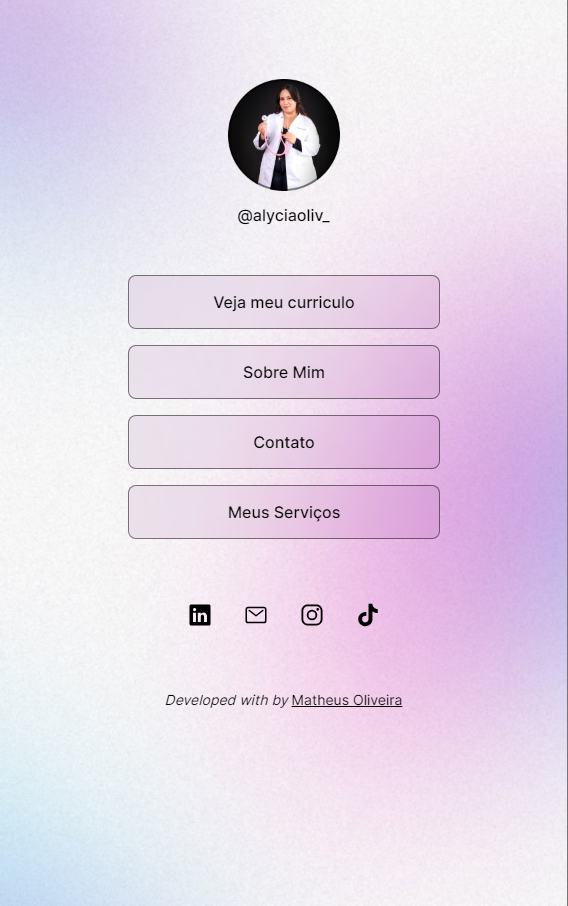

<h1 align="center"> Descubra os Serviços da Fisio Alycia: Seu Guia para Saúde e Bem-Estar </h1>

Este projeto tem como objetivo principal divulgar os serviços oferecidos pela fisioterapeuta Alycia Oliveira, bem como fornecer formas de contato para potenciais clientes. 

  <a href="#-tecnologias">Tecnologias</a>&nbsp;&nbsp;&nbsp;|&nbsp;&nbsp;&nbsp;
  <a href="#-projeto">Projeto</a>&nbsp;&nbsp;&nbsp;|&nbsp;&nbsp;&nbsp;
  <a href="#-layout">Layout</a>&nbsp;&nbsp;&nbsp;|&nbsp;&nbsp;&nbsp;
  <a href="#memo-licença">Licença</a>

  

 

  

## 🚀 Tecnologias

Esse projeto foi desenvolvido com as seguintes tecnologias:

- HTML e CSS
- Git e Github
- Figma

## 💻 Projeto

O Descubra os Serviços da Fisio Alycia é um agregador de links para usar como cartão de visitas online.

- [Acesse o projeto finalizado, online](https://maykbrito.github.io/devlinks)

## Licença

Esse projeto está sob a licença MIT.

---

<i>Developer with by</i> Matheus Oliveira .